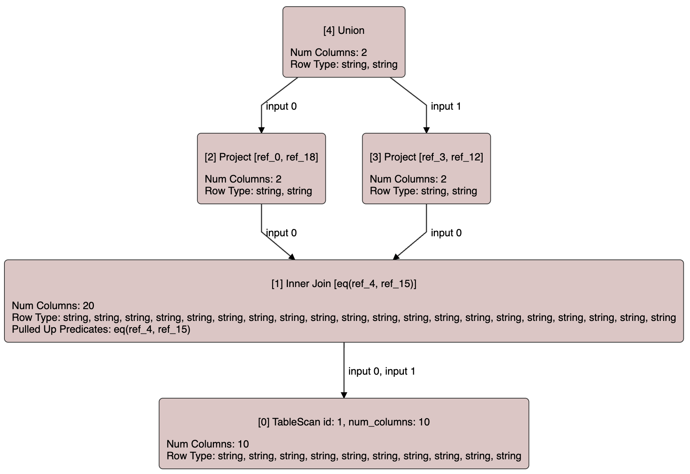
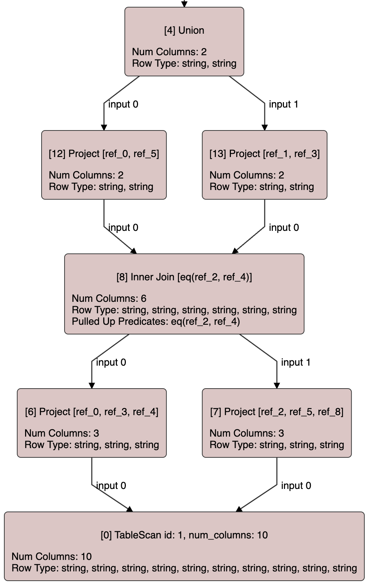

+++
title = 'A SQL query compiler from scratch in Rust (step by step): Part two, the query rewrite driver'
date = 2023-12-27T22:48:45+01:00
draft = true
+++

In the previous post of this series we introduced a couple of very basic rewrite rules.
In this one we are going to take a look at the rule application driver, responsible for
applying a set of rules while traversing the query graph until the query settles in a fix
point.

The rules we have seen so far implement a `SingleReplacementRule` trait with an `apply`
method that given a node may return a new node that must be used to replace the given
one in the query graph. The replacement
node must be semantically equivalent to the previous one and, hence, must provide the
same amount of columns as the previous one and these columns must have the same data types
as the old ones.

However, this simple interface doesn't work in all cases as illustrated in the following
section.

## Column pruning

Column pruning is the optimization that ultimately makes the table scan operators only
scan the columns of each table that are actually needed. In our offset-based representation 
this optimization works by pushing down _pruning_ projections. A _pruning_ projection is
a projection operator that doesn't forward all the columns from its input.

Consider the following example:



The join in node 1 projects 20 columns, 10 columns from each of its inputs. However, only 4 of them
are actually needed: columns 0 and 18 are used by its first parent and columns 3 and 12 are
used by it second parent. Also, the join itself uses columns 4 and 15 from its join condition.
Columns 0, 3 and 4 belong to its first input, while columns 12, 15 and 18 are the columns 2, 5
and 8 respectively from its second input.

Since we want to preserve the DAG-shape of the plan, we want to replace join 1 with one only
projecting the 6 columns that are actually needed. However, that involves replacing its parents
too since the columns referenced by them need to be remapped, since the new join will project
fewer columns. Ultimately, we want to end up with a plan like the one below:



Basically, we need to be able to write rules that may perform several nodes replacements at
the same time, as in the example above, where node 12 replaced node 2 and node 13 replaced
node 3. To achieve this, let's introduce a more generic `Rule` trait where the `apply`
function may return more than one node replacement:

```rust
pub trait Rule {
    fn rule_type(&self) -> OptRuleType;

    fn apply(&self, query_graph: &mut QueryGraph, node_id: NodeId)
        -> Option<Vec<(NodeId, NodeId)>>;
}
```

Each node replacement is presented by a pair of node IDs for the old and the new nodes.

`JoinPruningRule` can then be implemented using this interface so that given a join node,
whose parents are not using all the columns it projects, it replaces its parents with
new nodes referring to the columns of a the pruned version of the join. The code for this
rewrite rule can be seen [here](https://github.com/asenac/rust-sql-playground/blob/a82da60a428e037ecc1fefc9c2e73a5a59644e71/src/query_graph/optimizer/rules/join_pruning.rs).

Since `SingleReplacementRule` is just a special case for rules that only perform a single
node replacement, we can implement the more generic `Rule` trait for all `struct`s implementing
the `SingleReplacementRule` trait:

```rust
impl<T: SingleReplacementRule> Rule for T {
    fn rule_type(&self) -> OptRuleType {
        SingleReplacementRule::rule_type(self)
    }

    fn apply(
        &self,
        query_graph: &mut QueryGraph,
        node_id: NodeId,
    ) -> Option<Vec<(NodeId, NodeId)>> {
        self.apply(query_graph, node_id)
            .map(|replacement_node| vec![(node_id, replacement_node)])
    }
}
```

## The query rewrite driver

So far we have defined a `Rule` trait that all rewrite rules must implement. The
next step is to write the rule application driver to apply these rewrite rules while
traversing the query graph. In order to modify the query graph while traversing it,
we need a new visitation utility function that will take a new `QueryGraphPrePostVisitorMut`
trait:

```rust
pub enum PreOrderVisitationResult {
    VisitInputs,
    DoNotVisitInputs,
    Abort,
}

pub enum PostOrderVisitationResult {
    Continue,
    Abort,
}

pub trait QueryGraphPrePostVisitorMut {
    fn visit_pre(
        &mut self,
        query_graph: &mut QueryGraph,
        node_id: &mut NodeId,
    ) -> PreOrderVisitationResult;

    fn visit_post(
        &mut self,
        query_graph: &mut QueryGraph,
        node_id: &mut NodeId,
    ) -> PostOrderVisitationResult;
}
```

`QueryGraphPrePostVisitorMut` is very similar to its read-only version `QueryGraphPrePostVisitor`.
The main difference is that both the query graph and the ID of the current node are passed
via mutable reference.

Also, while applying rules we may need to abort the traversal. For that reason, we have made
`visit_post` able to return `Abort` to signal that.

A new `visit_mut` function, similar to the previously explained `visit_subgraph` one, using
a single stack for a pre-post order traversal has to be added to our `QueryGraph` `struct`:

```rust
impl QueryGraph {
    pub fn visit_mut<V>(&mut self, visitor: &mut V)
    where
        V: QueryGraphPrePostVisitorMut,
    {
        let mut stack = vec![VisitationStep::new(self.entry_node)];
        while let Some(step) = stack.last_mut() {
            if step.next_child.is_none() {
                match visitor.visit_pre(self, &mut step.node) {
                    PreOrderVisitationResult::Abort => break,
                    PreOrderVisitationResult::VisitInputs => {}
                    PreOrderVisitationResult::DoNotVisitInputs => {
                        let result = visitor.visit_post(self, &mut step.node);
                        stack.pop();
                        match result {
                            PostOrderVisitationResult::Abort => break,
                            PostOrderVisitationResult::Continue => continue,
                        }
                    }
                }
                step.next_child = Some(0);
            }

            let node = self.node(step.node);
            if step.next_child.unwrap() < node.num_inputs() {
                let input_idx = step.next_child.unwrap();
                step.next_child = Some(input_idx + 1);
                stack.push(VisitationStep::new(node.get_input(input_idx)));
                continue;
            }

            let result = visitor.visit_post(self, &mut step.node);
            stack.pop();
            match result {
                PostOrderVisitationResult::Abort => break,
                PostOrderVisitationResult::Continue => {}
            }
        }
    }
}
```

Now let's look at the rule application driver. We have called this component `Optimizer`
although something like `RewritePass` is perhaps more appropriate. An `Optimizer` is
basically a set of rules that are applied performing several traversal of the query
graph until a full traversal ends without performing any modification to the query graph.

Each rule indicates the part of the traversal it must be applied in. So, the first thing
we need to do is to group them:

```rust
pub struct Optimizer {
    rules: Vec<Box<dyn Rule>>,
    root_only_rules: Vec<usize>,
    top_down_rules: Vec<usize>,
    bottom_up_rules: Vec<usize>,
}

impl Optimizer {
    /// Builds an optimizer instance given a list of rules.
    pub fn new(rules: Vec<Box<dyn Rule>>) -> Self {
        let mut root_only_rules = Vec::new();
        let mut top_down_rules = Vec::new();
        let mut bottom_up_rules = Vec::new();
        for (id, rule) in rules.iter().enumerate() {
            match rule.rule_type() {
                OptRuleType::Always => {
                    top_down_rules.push(id);
                    bottom_up_rules.push(id);
                }
                OptRuleType::TopDown => top_down_rules.push(id),
                OptRuleType::BottomUp => bottom_up_rules.push(id),
                OptRuleType::RootOnly => root_only_rules.push(id),
            }
        }
        Self {
            rules,
            root_only_rules,
            top_down_rules,
            bottom_up_rules,
        }
    }
}
```